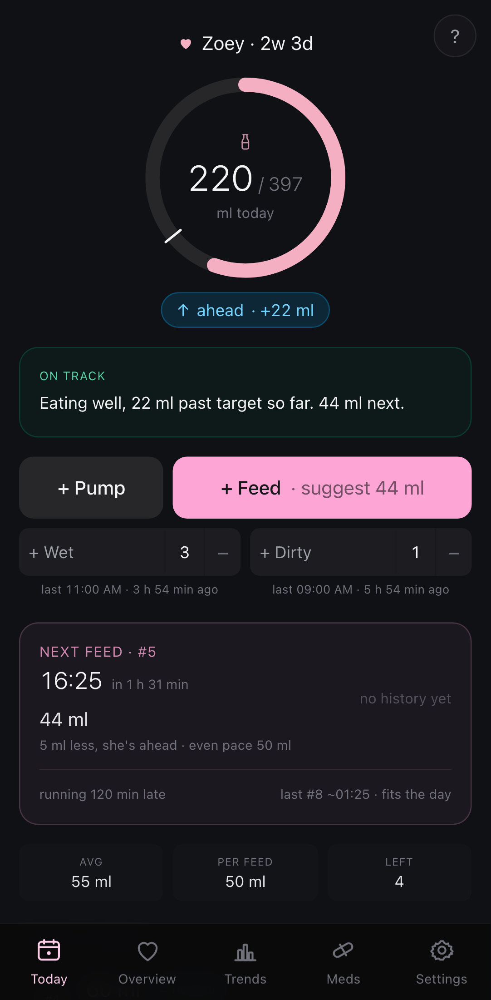
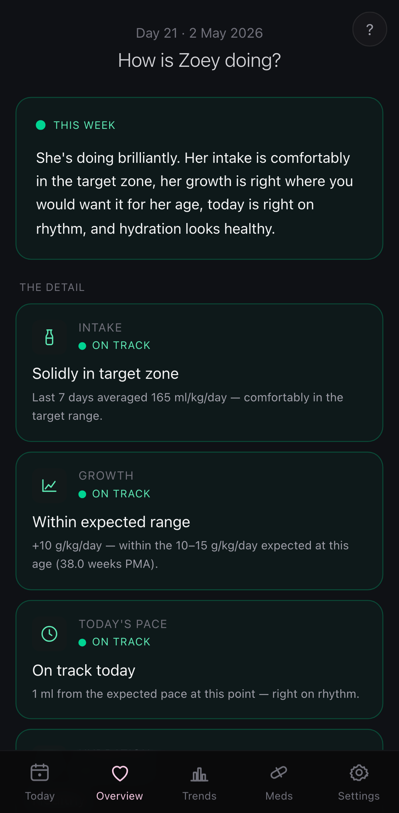
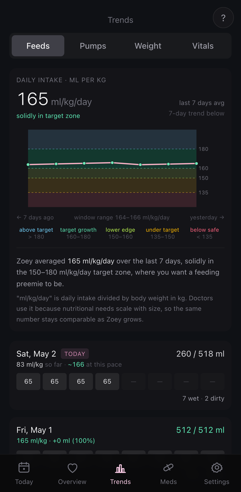

# Zoey Tracker

Mobile-first webapp for tracking feeds, pumps, diapers, weight, vitals, and
medications for a preterm baby. Surfaces same-feed-of-day historical
comparisons, weight-based daily intake targets, PMA-aware growth bands, and
Fenton 2025 percentile tracking — built around the actual decision-day
questions: *is this low feed normal?*, *are we on track today?*, *is she
gaining at the right rate?*

This is a personal app published openly as a working example. It's named for,
and originally built for, our daughter Zoey (born 35w preterm). To use it for
your own child, fork it, set the birth context in **Settings**, and update the
strings that reference "Zoey" if you want them gone.

<p align="center">
  
  
  
</p>

<p align="center"><sub><em>Screenshots show synthetic demo data generated by <code>e2e/seed-demo.ts</code>, not Zoey's actual numbers.</em></sub></p>

## Disclaimer — please read before using this for a real child

This app shows clinical-looking guidance: ml/kg/day intake bands,
PMA-aware weight-gain expectations, Fenton 2025 percentile curves,
"on track" / "watch" / "concern" colour coding. **None of that is
medical advice.** It's a self-built tracker that surfaces
already-published references next to your own logged numbers, to help
two sleep-deprived parents notice things sooner and keep a tidier
record for the next clinic visit. It is **not** a substitute for the
neonatologist, paediatrician, or feeding specialist looking after
your child.

**Where the numbers come from:**

- **Weight gain bands** (g/kg/day, age-stratified): AAP / ESPGHAN
  2022 nutrition guidelines for preterm infants and the Fenton 2013
  / 2025 growth-velocity tables. Implemented in
  [`backend/growth.py`](backend/growth.py) and
  [`frontend/src/lib/growth.ts`](frontend/src/lib/growth.ts).
- **Fenton 2025 percentile chart**: official UCalgary cutoff tables
  for **preterm girls** (CC BY-NC-ND), encoded in
  [`frontend/src/lib/fenton.ts`](frontend/src/lib/fenton.ts). The
  50th percentile is computed as the midpoint of the 10th/90th —
  within ~1% of the published median across 22–42w. **Boys, term
  babies, and post-term tracking are not what's plotted here.**
- **Daily intake bands** (ml/kg/day): defaults align with ESPGHAN
  2022 + the 150–160 ml/kg/day NICU goal cited by Brigham, UC Davis,
  and Johns Hopkins; below 135 is the "below safe stable phase"
  threshold ESPGHAN flags. **These four edges are configurable in
  Settings** — your team may give you different numbers.
- **Hydration floor**: 6 wet diapers / 24h, the commonly-cited
  general indicator (not a hard cutoff for preterm infants).
- **PMA + postnatal age**: gestational age at birth + days since
  birth. Drives which gain band applies.

**The defaults are tuned for preterm girls.** This was written for
Zoey, who was born at 35 weeks. The Fenton 2025 reference is the
**girls'** cutoff table; the g/kg/day expected-gain ladder is from
**preterm** literature; the intake bands assume a NICU-style
ml/kg/day target. **None of those defaults will fit a term baby
boy on demand-feed, or a child on solids, or any number of other
situations** — the colours and "watch / on track" verdicts will
read as nonsense.

**Every child is different.** A 28-week extreme preterm, a 35-week
late preterm with reflux, a term boy on demand feeds, and a child
with a feeding-tube wean plan all have legitimately different "good"
numbers. The bands above are population-level reference ranges, not
your child's prescription. If your team has given you specific
targets, or your child sits outside the population this was tuned
for:

- Open **Settings** in the app and update `target_concern` /
  `target_low` / `target_solid` / `target_high` to match your team's
  ml/kg/day numbers, plus `birth_date` / `gestational_age_weeks` /
  `birth_weight_grams`.
- The PMA-aware weight-gain bands and the Fenton-girls percentile
  curves are hard-coded. If your team uses different references
  (Fenton boys, Olsen, INTERGROWTH-21st, WHO term, …) or your child
  isn't in the population this app was tuned for, you'll need to
  fork and edit [`backend/growth.py`](backend/growth.py),
  [`frontend/src/lib/growth.ts`](frontend/src/lib/growth.ts), and
  [`frontend/src/lib/fenton.ts`](frontend/src/lib/fenton.ts).

**If a number on this app contradicts what your clinician has told
you, your clinician is right.**

## Features

### 🍼 Daily flow

The screens you tap every three hours.

- **Today** — progress ring vs the daily target, 7-tier pace chip, an
  adaptive next-feed card with catch-up math, and per-feed comparison badges
  (↓ ≈ ↑) against the same feed-of-day from the last 7 days.
- **Feeds** — bottle and breast (estimated, doesn't pollute bottle
  averages), scheduled + extras, free-text notes for ad-hoc context
  (fortifier, spit-up, refusal). A day-anchor override picker handles feeds
  that straddle the 02:30 day boundary cleanly.
- **Pumps** — 30-day supply chart with rolling 7-day average and a
  day-grouped detail view; edit + undo on every action.
- **Diapers** — single-tap wet / dirty counters, with a hydration verdict
  surfaced on Overview.

### 📈 Growth & clinical

- **Weight** — manual weigh-ins plus auto-fill on days you don't weigh
  (linear interpolation between manuals, trailing 7-day extrapolation
  forward), so the daily ml target keeps tracking her actual growth.
  Real measurements are visually distinct from estimates.
- **Fenton 2025 percentile chart** — weight history plotted against the
  girls' reference percentiles on a PMA x-axis. Per-row gain coloured
  against PMA-aware bands (Fenton + AAP/ESPGHAN 2022).
- **Vitals** — per-day HR / SpO2 summaries from an Owlet Dream Sock
  (optional; off if you don't configure credentials).
- **Meds** — daily checklist with configurable medications and per-med
  dose counts; one-off "extra" doses without polluting the schedule.

### 🧭 Insight & sharing

- **Overview** — at-a-glance status across Intake, Growth, Today's pace
  and Hydration. Each indicator carries a short narrative explaining
  *why* it's coloured the way it is.
- **Reminders** — Web Push 15 min before each scheduled feed, adaptive to
  her actual rhythm rather than a rigid grid. iOS requires the PWA
  installed to the Home Screen.
- **Doctor report** — `/api/report?days=14` renders a printable HTML
  summary (intake table, weight history with gains, all feed notes).
  Manual weights only, so estimates don't bleed into the clinical view.
  iOS Safari "Save to Files → PDF" handles export.
- **Read-only sharing** — issue separate viewer PINs so grandparents,
  family, and the partner-on-night-shift can see live status without
  being able to log, edit, delete, or reach Settings. The UI hides
  destructive affordances in viewer mode; the API enforces it
  independently.

### ✨ Small things

- **Symmetrical toasts** — every save flashes a confirmation; every
  delete shows a 5-second undo toast that re-creates the snapshot via
  the existing POST.
- **Encouragement card on Today** — a friendly one-liner that reads the
  state of the day and adapts to it (good rhythm vs. low day, last feed
  coming up, etc.).
- **Built-in Help modal** — every screen has context-aware notes one tap
  away, including the clinical references behind the bands and bands.

## Stack

- **Backend** — FastAPI + SQLite, Python 3.12, web-push (`pywebpush`), bcrypt
  for the passcode, signed session cookie via `itsdangerous`.
- **Frontend** — React 19 + TanStack Query 5 + Tailwind v4 + Vite +
  TypeScript. PWA service worker for installable iOS standalone mode.
- **Container** — single multi-stage Docker image (frontend bundle copied
  into the FastAPI static dir). No Node runtime in production.

## Local development

```bash
# Backend
python -m venv .venv && source .venv/bin/activate
pip install -r backend/requirements.txt

cp .env.example .env
python scripts/hash_passcode.py 123456                          # paste hash into ZOEY_PASSCODE_HASH=
python -c "import secrets; print(secrets.token_urlsafe(48))"     # paste into SESSION_SECRET=

uvicorn backend.main:app --reload --port 8000

# Frontend (separate terminal)
cd frontend
npm install
npm run dev   # http://localhost:5173, proxies /api → :8000
```

The backend refuses to boot if `ZOEY_PASSCODE_HASH` or `SESSION_SECRET` is
empty — this is intentional, to avoid silently running with a known-public
HMAC key or no auth.

When pasting a bcrypt hash into `.env` for `docker-compose`'s `env_file:`,
escape every `$` as `$$` — Compose interprets a single `$` as a variable
reference.

## Production build

```bash
docker compose up --build
# http://localhost:8087  (bound to 127.0.0.1 only — front with a TLS proxy)
```

The container runs as UID 1000, with `read_only: true`, `cap_drop: ALL`,
`no-new-privileges`, and capped memory + pids. Put it behind a TLS-terminating
reverse proxy of your choice (nginx, Caddy, Traefik, NPM); the app sets HSTS,
X-Frame-Options, CSP, and Permissions-Policy headers itself.

## On first boot

The seeded `app_settings` are intentionally generic (today's date as
`birth_date`, 40w GA, 3000 g birth weight). Open **Settings** and replace
those with the actual values before relying on the PMA-aware bands and the
Fenton percentile chart.

## Auth

- Single shared passcode stored as a bcrypt hash (cost factor 12). Designed
  for a household of two adults — no per-user attribution.
- Optional read-only viewer passcodes: family members can be given a separate
  PIN that grants read-only access (no writes, no Settings).
- 90-day signed session cookie (HttpOnly, Secure, SameSite=Lax) for the
  edit account; 7 days for viewers.
- 5 failed attempts in 15 minutes → 429 lockout (in-memory, resets on
  container restart).
- The rate limiter trusts `X-Forwarded-For` only when the connection peer is
  in `TRUSTED_PROXIES` (default: loopback). Bind the container to localhost
  and proxy in front, or update the allowlist if your proxy lives on another
  host.

To rotate the passcode:

```bash
python scripts/hash_passcode.py <new-pin>
# update ZOEY_PASSCODE_HASH in .env (escape $ as $$ for compose) and redeploy
```

## Project structure

```
backend/
  main.py            FastAPI app + security headers + SPA fallback
  auth.py            passcode + signed session cookie + rate limit
  db.py              schema + additive migrations on startup
  repo.py            thin SQLite data-access helpers (parameterised)
  comparisons.py     feeding-day indexing, time normalisation
  services.py        compute_overview, regenerate_auto_weights, …
  scheduler.py       background reminder loop (Web Push)
  push.py            VAPID key handling, push delivery
  owlet.py           Owlet Dream Sock polling + vitals aggregation
  routers/           feeds, pumps, weight, diapers, meds, settings,
                       push, overview, dashboard, report, vitals, auth
frontend/
  src/api/           client + typed hooks
  src/components/    ToastHost, FentonChart, charts, modals, sparklines
  src/screens/       Today, Overview, History (Feeds + Weight + Pumps +
                       Vitals sub-tabs), Meds, Settings
  src/lib/           growth bands, fenton 2025 reference, push helpers,
                       formatting, encouragement, narratives
scripts/
  hash_passcode.py        one-shot bcrypt helper
  restore-from-snapshot.py  restore from JSON export
  test_owlet.py             interactive Owlet probe
docker-compose.yml         base service definition
Dockerfile                 multi-stage: frontend bundle → FastAPI image
```

## Data model

SQLite at `/data/zoey.db` (bind-mount this volume to persist the database):

- `weight_entries` — manual + auto-filled weights, `is_auto` distinguishes
- `feeds` — `fed_at`, `amount_ml`, `notes`, `is_extra`, `method`,
  `duration_min`, `feeding_day_override`
- `pumps` — `pumped_at`, `amount_ml`, `notes`
- `diapers` — `recorded_at`, `kind` (`wet`|`dirty`), `notes`
- `vitals` / `vitals_daily` — raw + per-day Owlet aggregates
- `meds` / `med_doses` — recurring meds and dose log
- `push_subscriptions` — Web Push endpoints + keys, last-notified marker
- `viewer_passcodes` — read-only PINs (separate from the edit passcode)
- `app_settings` — anchor time, feeds per day, colour bands, birth date,
  GA weeks, etc. (mutable via Settings UI)

## Tests

Three layers, run from the repo root:

```bash
# Backend unit + integration (pytest + FastAPI TestClient + tmp SQLite)
.venv/bin/pip install -r backend/requirements-dev.txt
.venv/bin/pytest

# Frontend unit (vitest, pure libs only — no DOM rendering)
cd frontend && npm test

# End-to-end (Playwright, single chromium browser, mobile viewport)
npm install && npx playwright install chromium
npm run e2e
```

The E2E harness builds the frontend, symlinks `frontend/dist` to `static/`,
and starts a real FastAPI process on port 8081 with a tmp DB and a known
passcode (`9999`). Specs live in `e2e/specs/`.

For ad-hoc debugging there's also a screenshot tool that uses the same
harness — boot `./e2e/serve.sh` separately, then:

```bash
npm run screenshot                       # all five tabs
npm run screenshot -- today overview     # specific tabs

# Want a populated UI for product-page screenshots? Seed first:
npx tsx e2e/seed-demo.ts && npm run screenshot
```

PNGs land in `e2e/screenshots/`. The screenshots embedded above were
captured this way and live in `docs/screenshots/`. Note:
chromium-mobile is not iOS Safari, so iOS-specific PWA layout bugs
(safe-area handling, position:fixed quirks) won't reproduce here — for
those, a real device screenshot is still the ground truth.

## Security

See [SECURITY.md](SECURITY.md) for the threat model, data-handling stance,
and how to report vulnerabilities.

## License

MIT — see [LICENSE](LICENSE).
